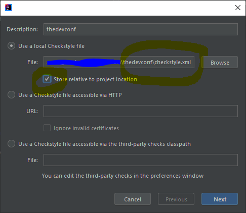

# TheDevConf

Applications, services and utilities supporting [The Developers Conference](https://thedevconf.com)

# Technologies

Backend:
_ Quarkus + JAX-RS
_ AWS Elastic Beanstalk, RDS, Cognito & more

Frontend: \* Vue

# How to run in development mode (Linux/MacOS)

## Check/Install system tools

- [Docker Desktop](https://docs.docker.com/get-docker/)
  Check:

```shell
docker ps
```

- [SDKMan](https://sdkman.io/)
  Install:

```shell
curl -s "https://get.sdkman.io" | bash
source "$HOME/.sdkman/bin/sdkman-init.sh"
```

Check:

```shell
sdk list java
```

### Install Java SDK [GraalVM](https://www.graalvm.org/)

```shell
sdk install java 21.2.0.r16-grl
```

### Install [Maven](https://sdkman.io/sdks#maven)

```shell
sdk install maven
```

## Start a MySQL database

This is how using Docker

Set mysql variables:

```shell
export MYSQL_ROOT_PASSWORD="some${RANDOM}password"
export MYSQL_HOST="0.0.0.0"
export MYSQL_PORT="3336"
export MYSQL_DB="thedevconf"
export MYSQL_VERSION="5.7"

```

Start a MySQL container:

```shell
docker run --rm \
  --name $MYSQL_DB \
  -p $MYSQL_HOST:$MYSQL_PORT:3306 \
  -e MYSQL_ROOT_PASSWORD=$MYSQL_ROOT_PASSWORD \
  -e MYSQL_DATABASE=$MYSQL_DB \
  -d mysql:$MYSQL_VERSION
```

Check your MySQL Connection:

```shell
mysql --host=$MYSQL_HOST --port=$MYSQL_PORT -uroot -p$MYSQL_ROOT_PASSWORD $MYSQL_DB
```

```
MySQL [thedevconf]> show databases;
+--------------------+
| Database           |
+--------------------+
| information_schema |
| mysql              |
| performance_schema |
| sys                |
| thedevconf         |
+--------------------+
```

## Start the API module

Set the database connection and quarkus variables

```shell
export DATASOURCE_URL="jdbc:mysql://$MYSQL_HOST:$MYSQL_PORT/$MYSQL_DB"
export DATASOURCE_USERNAME=root
export DATASOURCE_PASSWORD=$MYSQL_ROOT_PASSWORD
export DATASOURCE_KIND="mysql"
export HIBERNATE_ORM_DATABASE_GENERATION="none"
```

Compile and run the API in development mode

```shell
mvn -f tdc-api/pom.xml
```

## IDE Setup

## Install the CheckStyle on the IntelliJ

Find and Install the [CheckStyle-IDEA](https://plugins.jetbrains.com/plugin/1065-checkstyle-idea) plugin clicking on **File -> Settings -> Plugins**:


After that, it's needed to import the configuration on the [**checkstyle.xml**](<(checkstyle.xml)>) on the root directory of the project. Go to **File -> Settings -> Tools -> Checkstyle** and go to **Configuration File** then click on the **Add** button (**+** signal at right), browse to the **checkstyle.xml** file. Mark the **"Store relative to project location"** checkbox and click on **"Next"** button.



It will ask you to provide some properties, you don't need it then click on **"Next"** button to finish the setup.


Don't forget to mark this file as the "Active" one. Also, choose the "8.32" CheckStyle version like the image below:


Now, you'll need to import the "checkstyle.xml" file configuration at **Editor -> Code Style -> Java** like the image below:


It's done! On the IntelliJ footer, you will be able to find out the **_CheckSyle_** plugin tab. There you will be able to run the code checking process (on the project or module levels or in the opened file).

## Frontend

To run the `frontend` follows the [steps](https://github.com/CaravanaCloud/thedevconf/tree/main/frontend)
